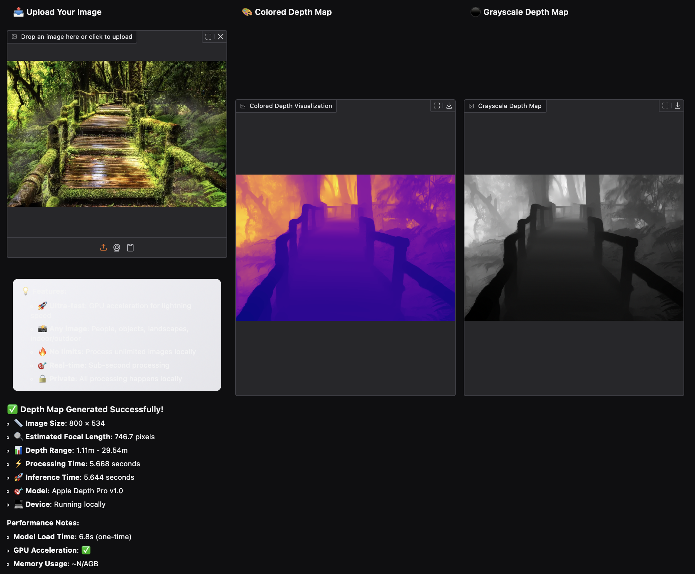

# Depth Pro - AI Depth Map Generator

Transform any 2D image into a detailed 3D depth map using Apple's open-source **Depth Pro** model.



### Example Output


---

This project provides two easy ways to get started: a Python script with a Gradio UI, or an interactive Jupyter Notebook.

## Option 1: Run with Python (Local)

Works on **Mac**, **Windows**, and **Linux** — the script auto-detects your GPU.

1.  **Clone the repository**:
    ```bash
    git clone https://github.com/kikugo/ml-depth-pro-demo.git
    cd ml-depth-pro-demo
    ```

2.  **Install dependencies** (Python ≥ 3.10 recommended):
    ```bash
    pip install -e .
    pip install -r requirements.txt
    ```

3.  **Run the Demo**:
    ```bash
    python run.py
    ```
    Model weights (~1.8 GB) will be downloaded automatically on the first run.
    This launches a local Gradio interface in your browser.

---

## Option 2: Batch Processing (CLI)

Process an entire folder of images from the command line:

```bash
python batch.py --input ./photos --output ./depth_maps
```

Add `--npy` to also save raw depth values as NumPy arrays:

```bash
python batch.py -i ./photos -o ./depth_maps --npy
```

---

## Option 3: Run with Jupyter Notebook (Universal)

Use the `Depth_Pro_Universal.ipynb` notebook for an interactive experience that works everywhere.

-   **How it Works**: The notebook uses `ipywidgets` for a native file-upload button. After you upload an image and click "Generate," it displays the original image, colored depth map, and grayscale depth map directly in the notebook output, along with performance metrics.
-   **Where to Run**:
    -   **Google Colab**: Upload the notebook, and it will set up the environment for you.
    -   **Local Jupyter**: Run `jupyter notebook Depth_Pro_Universal.ipynb` in the project directory.
---

## Features

- **GPU Accelerated**: Optimized for Apple Silicon (MPS) and NVIDIA (CUDA), with a CPU fallback.
- **Metric Depth**: Predicts true, real-world depth and estimates focal length automatically.
- **Private**: All processing happens 100% locally on your machine.
- **Cross-Platform**: Single script works on Mac (MPS), Windows/Linux (CUDA), or CPU.
- **Batch Processing**: Process entire folders from the CLI with progress tracking.
- **Raw Depth Export**: Download `.npy` depth arrays for 3D reconstruction or custom processing.
- **Dark/Light Mode**: Gradio UI follows your system theme preference.
- **Open-Source**: Based on Apple's powerful research, free to use without API keys.

---

## Research

This work is based on the paper "Depth Pro: Sharp Monocular Metric Depth in Less Than a Second" (2024) by A. Bochkovskii, A. Delaunoy, H. Germain, M. Santos, Y. Zhou, S. Richter, and V. Koltun.

---

> **Note:** This is a personal project to try out Apple's [ml-depth-pro](https://github.com/apple/ml-depth-pro) model. After getting it working locally with easy-to-use scripts, I decided to publish it so anyone else interested can try it too. The core model, logic, and license are from the original Apple repository.


## Credits

- **Original Model**: [apple/ml-depth-pro](https://github.com/apple/ml-depth-pro)
- **UI Framework**: [Gradio](https://gradio.app/)
- **Notebook Widgets**: [ipywidgets](https://ipywidgets.readthedocs.io/en/latest/)

## License

See [LICENSE](./LICENSE) for details (Apple Sample Code License).
